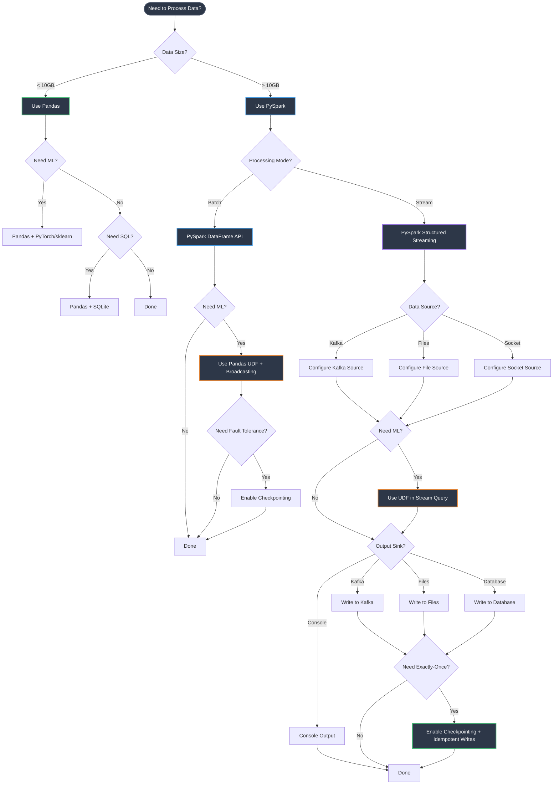
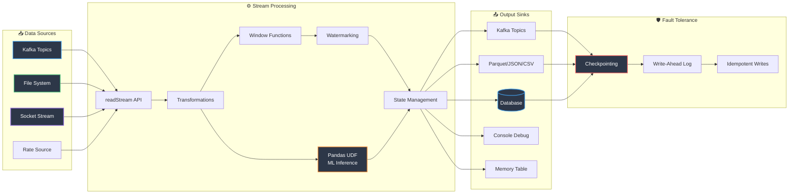
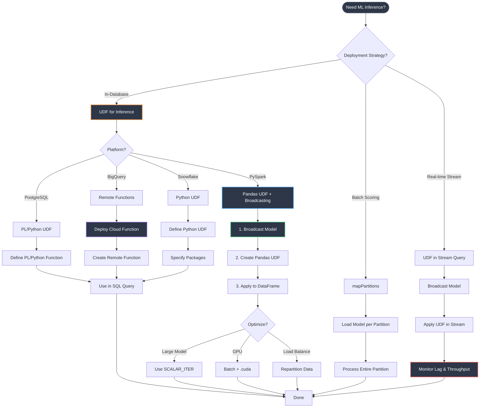
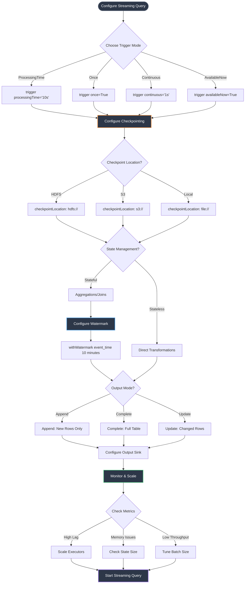

## Quick Decision Matrix

```
Data Size Decision:
├─ < 10 GB       → Pandas
├─ 10 GB - 100 GB → Pandas (if RAM allows) or PySpark
├─ 100 GB - 10 TB → PySpark
└─ > 10 TB       → PySpark definitely

Processing Type:
├─ Batch         → PySpark, Hadoop MapReduce
├─ Interactive   → PySpark, Presto/Trino
├─ Streaming     → PySpark (micro-batch), Flink (real-time)
├─ ML/Analytics  → PySpark
└─ Transactions  → PostgreSQL, MySQL

Latency Requirements:
├─ Minutes-Hours → PySpark, Hadoop
├─ Seconds       → PySpark Streaming
├─ Milliseconds  → Apache Flink, Kafka Streams
└─ Microseconds  → In-memory DB, Redis
```
### 📊 Enhanced Decision Tree

```
Need to process data?
│
├─ Data < 10GB?
│  ├─ YES → Use Pandas ✅
│  │  ├─ Need SQL queries?
│  │  │  └─ YES → Use Pandas + SQLite
│  │  ├─ Need ML inference?
│  │  │  └─ YES → Use Pandas + PyTorch/sklearn
│  │  └─ Need visualizations?
│  │     └─ YES → Add Matplotlib/Plotly
│  
└─ Data > 10GB?
   └─ YES → Use PySpark ✅
      │
      ├─── Processing Mode?
      │    │
      │    ├─ Batch Processing?
      │    │  └─ YES → PySpark DataFrame API
      │    │     ├─ Complex transformations? → Use UDFs
      │    │     ├─ SQL-heavy logic? → Use Spark SQL
      │    │     └─ Need checkpointing? → Enable `.checkpoint()`
      │    │
      │    └─ Stream Processing?
      │       └─ YES → PySpark Structured Streaming ✅
      │          │
      │          ├─── Data Source?
      │          │    ├─ Kafka → Use `.format("kafka")`
      │          │    ├─ File system → Use `.format("csv/json/parquet")`
      │          │    ├─ Socket → Use `.format("socket")`
      │          │    └─ Rate source (testing) → Use `.format("rate")`
      │          │
      │          ├─── Processing Requirements?
      │          │    ├─ Stateless transformations → Use `.select()`, `.filter()`
      │          │    ├─ Stateful operations → Use `.groupBy().agg()`
      │          │    ├─ Windowed aggregations → Use `.window()` or `.groupBy(window())`
      │          │    ├─ Watermarking needed? → Use `.withWatermark()`
      │          │    └─ Join streams? → Use `.join()` with watermarks
      │          │
      │          ├─── Output Sink?
      │          │    ├─ Console (debug) → `.writeStream.format("console")`
      │          │    ├─ File system → `.format("parquet/csv/json")`
      │          │    ├─ Kafka → `.format("kafka")`
      │          │    ├─ Database → `.foreach()` or `.foreachBatch()`
      │          │    └─ Memory (testing) → `.format("memory")`
      │          │
      │          └─── Delivery Semantics?
      │               ├─ At-least-once → Default (no idempotency)
      │               ├─ Exactly-once → Enable checkpointing + idempotent writes
      │               └─ At-most-once → No checkpointing (not recommended)
      │
      ├─── Need ML Predictions?
      │    └─ YES → Add PyTorch/TensorFlow ✅
      │       │
      │       ├─── Deployment Strategy?
      │       │    │
      │       │    ├─ In-Database Inference?
      │       │    │  └─ YES → Use UDFs for Inference ✅
      │       │    │     │
      │       │    │     ├─ PySpark → Pandas UDF with model broadcasting
      │       │    │     ├─ PostgreSQL → PL/Python UDF
      │       │    │     ├─ BigQuery → Remote Functions + Cloud Functions
      │       │    │     └─ Snowflake → Python UDF with packages
      │       │    │
      │       │    ├─ Batch Scoring?
      │       │    │  └─ Use `.mapPartitions()` with model loading
      │       │    │
      │       │    └─ Real-time Inference?
      │       │       └─ Use UDF in Streaming query
      │       │
      │       └─── Model Optimization?
      │            ├─ Broadcasting → `sc.broadcast(model)` (critical!)
      │            ├─ Batch processing → Process partitions, not rows
      │            ├─ GPU support → Use `.cuda()` in UDF
      │            └─ Model caching → Load once per executor
      │
      ├─── Data Format?
      │    ├─ CSV → `.read.csv()`
      │    ├─ JSON → `.read.json()`
      │    ├─ Parquet → `.read.parquet()` (recommended for big data)
      │    ├─ Avro → `.read.format("avro")`
      │    ├─ Delta Lake → `.read.format("delta")`
      │    └─ Database → `.read.jdbc()` or UDFs
      │
      ├─── Performance Optimization?
      │    ├─ Partitioning → `.repartition()` or `.coalesce()`
      │    ├─ Caching → `.cache()` or `.persist()`
      │    ├─ Broadcasting → `broadcast()` for small tables in joins
      │    ├─ Columnar storage → Use Parquet
      │    └─ Predicate pushdown → Filter early with `.filter()`
      │
      └─── Fault Tolerance?
           ├─ Checkpointing → `.checkpoint()` for lineage truncation
           ├─ Write-ahead logs → Enable for streaming
           ├─ Retry logic → Configure `spark.task.maxFailures`
           └─ Graceful shutdown → Handle SIGTERM signals

```

### 🎯 Streaming-Specific Decision Path

```
Need PySpark Streaming?
│
├─── Step 1: Choose Trigger Mode
│    ├─ ProcessingTime → `.trigger(processingTime='10 seconds')`
│    ├─ Once → `.trigger(once=True)` (batch-like)
│    ├─ Continuous → `.trigger(continuous='1 second')` (experimental)
│    └─ AvailableNow → `.trigger(availableNow=True)` (Spark 3.3+)
│
├─── Step 2: Configure Checkpointing (Required!)
│    └─ `.option("checkpointLocation", "s3://bucket/checkpoints")`
│       ├─ HDFS → High reliability
│       ├─ S3 → Cloud storage
│       └─ Local → Testing only (not for production)
│
├─── Step 3: Handle State Management
│    ├─ Stateless → Direct transformations (map, filter)
│    ├─ Stateful → Aggregations, joins, windowing
│    │  ├─ State timeout → `.withWatermark("timestamp", "10 minutes")`
│    │  └─ State store → Automatic, but monitor size
│    └─ Custom state → `.mapGroupsWithState()` or `.flatMapGroupsWithState()`
│
├─── Step 4: Implement Watermarking (for Late Data)
│    └─ `.withWatermark("event_time", "10 minutes")`
│       ├─ Defines max lateness allowed
│       ├─ Enables state cleanup
│       └─ Required for outer joins
│
├─── Step 5: Configure Output Mode
│    ├─ Append → Only new rows (default for stateless)
│    ├─ Complete → Entire result table (aggregations only)
│    └─ Update → Only changed rows (stateful operations)
│
└─── Step 6: Monitor & Scale
     ├─ Monitor lag → Check input vs processing rate
     ├─ Scale executors → Increase based on throughput
     ├─ Tune batch size → Balance latency vs throughput
     └─ Track state size → Prevent memory overflow

```

### 🚀 UDF Decision Matrix

```
Need to extend PySpark functionality?
│
├─── Basic Transformations?
│    └─ NO UDF needed → Use built-in functions (faster)
│
├─── Complex Python Logic?
│    └─ YES → Choose UDF Type:
│       │
│       ├─ Row-by-row processing?
│       │  └─ Standard UDF → `@udf(returnType)`
│       │     ⚠️ Slow: Serialization overhead
│       │
│       ├─ Vectorized operations?
│       │  └─ Pandas UDF → `@pandas_udf(returnType)`
│       │     ✅ Fast: Columnar processing with Arrow
│       │     │
│       │     ├─ SCALAR → Transform columns
│       │     ├─ GROUPED_MAP → Custom aggregations per group
│       │     ├─ GROUPED_AGG → Aggregate with Pandas
│       │     └─ SCALAR_ITER → Process batches (ML inference)
│       │
│       └─ ML Model Inference?
│          └─ YES → Use Pandas UDF with Broadcasting ✅
│             │
│             ├─ Step 1: Broadcast model
│             │  └─ `broadcast_model = sc.broadcast(model)`
│             │
│             ├─ Step 2: Create Pandas UDF
│             │  └─ `@pandas_udf(FloatType())`
│             │     def predict(features: pd.Series) -> pd.Series:
│             │         model = broadcast_model.value
│             │         return model.predict(features)
│             │
│             ├─ Step 3: Apply to DataFrame
│             │  └─ `df.withColumn("prediction", predict(col("features")))`
│             │
│             └─ Performance Tips:
│                ├─ Use SCALAR_ITER for large models
│                ├─ Batch predictions for GPU efficiency
│                ├─ Repartition data for balanced load
│                └─ Monitor executor memory usage

```

### 💾 Data Sink Decision Tree

```
Where to write results?
│
├─── Development/Testing?
│    ├─ Console → `.writeStream.format("console").start()`
│    └─ Memory → `.writeStream.format("memory").queryName("table").start()`
│
├─── Production Storage?
│    ├─ File System (HDFS/S3)?
│    │  ├─ Parquet → `.format("parquet")` (recommended)
│    │  ├─ JSON → `.format("json")`
│    │  ├─ CSV → `.format("csv")`
│    │  └─ Delta Lake → `.format("delta")` (ACID transactions)
│    │
│    ├─ Message Queue?
│    │  └─ Kafka → `.format("kafka").option("topic", "output")`
│    │
│    ├─ Database?
│    │  ├─ JDBC → Use `.foreachBatch()` with JDBC write
│    │  ├─ NoSQL → Use `.foreach()` with custom writer
│    │  └─ UDF in DB → Create table, then use SQL UDF for inference
│    │
│    └─ Custom Logic?
│       ├─ `.foreach()` → Row-by-row (slow)
│       └─ `.foreachBatch()` → Batch processing (recommended)
│          └─ def write_batch(df, epoch_id):
│              # Custom write logic (JDBC, API calls, etc.)
│              df.write.jdbc(...)

```

### ⚡ Quick Reference: When to Use What

| Scenario | Tool/Pattern | Why |
|----------|-------------|-----|
| **Data < 10GB** | Pandas | Faster for small data, simpler API |
| **Data 10GB - 1TB** | PySpark | Distributed processing, handles OOM |
| **Data > 1TB** | PySpark + Parquet | Columnar storage, predicate pushdown |
| **ML Inference in PySpark** | Pandas UDF + Broadcasting | Vectorized, efficient model reuse |
| **ML Inference in PostgreSQL** | PL/Python UDF | In-database processing, no data export |
| **ML Inference in BigQuery** | Remote Functions | Serverless, scalable to petabytes |
| **Real-time Streaming** | PySpark Streaming + Kafka | Micro-batch, exactly-once semantics |
| **Sub-second Latency** | Flink or Kafka Streams | True real-time, event-by-event |
| **Complex Aggregations** | Window functions + Watermark | Handle late data, state management |
| **Large Model Inference** | SCALAR_ITER Pandas UDF | Batch processing, GPU support |
| **Join Streams** | Stream-Stream Join + Watermark | Required for bounded state |
| **Deduplication** | `.dropDuplicates()` + Watermark | Stateful, memory-efficient |
| **Checkpointing** | HDFS/S3 location | Fault tolerance, exactly-once |
| **Testing Streaming** | Memory sink + rate source | Fast iteration, no external deps |

---

## 📊 Visual Decision Flow Diagrams

### Main Decision Flow



### PySpark Streaming Architecture Flow



### UDF Inference Decision Flow



### Streaming Trigger & Checkpoint Configuration



---

## 🔧 Configuration Cheat Sheet

### PySpark Streaming Minimal Setup

```python
# 1. Read from Kafka
stream_df = spark.readStream \
    .format("kafka") \
    .option("kafka.bootstrap.servers", "localhost:9092") \
    .option("subscribe", "input-topic") \
    .load()

# 2. Transform (with ML inference)
from pyspark.sql.functions import col, from_json
from pyspark.sql.types import StringType

# Broadcast model
broadcast_model = spark.sparkContext.broadcast(trained_model)

@pandas_udf(FloatType())
def predict_udf(features: pd.Series) -> pd.Series:
    model = broadcast_model.value
    return pd.Series(model.predict(features.values.reshape(-1, 1)))

# Apply transformations
result_df = stream_df \
    .select(from_json(col("value").cast("string"), schema).alias("data")) \
    .select("data.*") \
    .withColumn("prediction", predict_udf(col("features")))

# 3. Write to Kafka with checkpointing
query = result_df \
    .selectExpr("CAST(id AS STRING) AS key", "to_json(struct(*)) AS value") \
    .writeStream \
    .format("kafka") \
    .option("kafka.bootstrap.servers", "localhost:9092") \
    .option("topic", "output-topic") \
    .option("checkpointLocation", "/path/to/checkpoint") \
    .trigger(processingTime='10 seconds') \
    .start()

query.awaitTermination()
```

### Watermarking Example

```python
# Handle late data with watermarking
windowed_df = stream_df \
    .withWatermark("event_time", "10 minutes") \
    .groupBy(
        window(col("event_time"), "5 minutes"),
        col("device_id")
    ) \
    .agg(
        avg("temperature").alias("avg_temp"),
        max("temperature").alias("max_temp"),
        count("*").alias("record_count")
    )
```

### Stream-Stream Join with Watermark

```python
# Join two streams with watermarks
stream1 = stream1_df.withWatermark("timestamp", "10 minutes")
stream2 = stream2_df.withWatermark("timestamp", "15 minutes")

joined = stream1.join(
    stream2,
    expr("""
        stream1.id = stream2.id AND
        stream1.timestamp >= stream2.timestamp AND
        stream1.timestamp <= stream2.timestamp + interval 5 minutes
    """)
)
```

---

## 📈 Performance Comparison

| Operation | Standard UDF | Pandas UDF | Pandas UDF + Broadcasting | Built-in Functions |
|-----------|-------------|------------|--------------------------|-------------------|
| **Throughput** | 1x (baseline) | 10-50x | 50-100x | 100-1000x |
| **Serialization** | Row-by-row | Columnar (Arrow) | Columnar (Arrow) | Native |
| **Model Loading** | Per row | Per partition | Once per executor | N/A |
| **Best For** | Simple logic | Vectorized ops | ML inference | SQL operations |
| **GPU Support** | ❌ | ✅ | ✅ | ❌ |

### Streaming Latency Targets

| Trigger Mode | Latency | Use Case |
|--------------|---------|----------|
| **ProcessingTime='1s'** | ~1-2 seconds | Near real-time dashboards |
| **ProcessingTime='10s'** | ~10-15 seconds | Standard streaming ETL |
| **ProcessingTime='1m'** | ~1-2 minutes | Aggregated analytics |
| **Once** | Batch-like | Catch-up processing |
| **Continuous** | < 1 second | Experimental, low latency |

---

## 🎯 Best Practices Summary

### ✅ DO

- **Use Pandas UDF** for ML inference (50-100x faster than standard UDF)
- **Broadcast models** to executors (critical for performance)
- **Enable checkpointing** for streaming (fault tolerance, exactly-once)
- **Use watermarking** for stateful operations (prevents unbounded state)
- **Repartition data** for load balancing
- **Monitor lag** in streaming queries
- **Use Parquet** for storage (columnar, compressed)
- **Filter early** with predicate pushdown
- **Test with memory sink** before production

### ❌ DON'T

- **Don't use standard UDF** for ML inference (too slow)
- **Don't load model per row** (use broadcasting)
- **Don't skip checkpointing** in production streaming
- **Don't ignore late data** (configure watermarks)
- **Don't use CSV** for big data (use Parquet)
- **Don't forget to `.stop()`** streaming queries
- **Don't over-partition** (more partitions = more overhead)
- **Don't cache everything** (monitor memory usage)